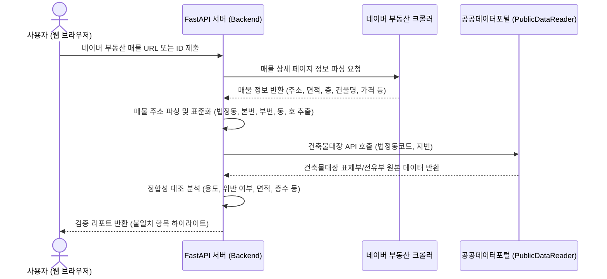

# VeriHouse - 네이버 부동산 매물 & 공공데이터 정합성 검증 솔루션 기획서

본 프로젝트 **VeriHouse**는 네이버 부동산에 등록된 주거용 매물 정보와 대한민국 정부의 공공데이터(건축물대장)를 대조하여, 정보가 불일치하거나 불법 요소가 숨겨진 '허위/오도 매물'을 신속하게 탐지하는 솔루션입니다. 

기본적으로 사용자가 단일 매물을 입력하면 실시간 검증을 수행하는 **방안 A(개별 검증 도구)**를 우선 구현하며, 추후 지역별 대량 수집 및 통계를 제공하는 **방안 B(대량 수집 및 대시보드 모니터링)**로의 매끄러운 확장이 가능하도록 시스템의 모듈화 및 아키텍처를 유연하게 설계합니다.

---

## 1. 기획 배경 및 해결하고자 하는 문제

부동산 거래(특히 빌라, 다세대주택 등) 시 매도인이나 중개업자가 등록한 정보와 실제 공부상(공적 장부) 정보가 달라 임차인/매수인이 피해를 입는 사례가 지속적으로 발생하고 있습니다.

### 핵심 탐지 대상 (주요 불일치 유형)
1. **근생빌라 (불법 용도변경)**: 상가용 건물(2종 근린생활시설)을 주거용(빌라)으로 불법 개조하여 분양/임대하는 행위. 세입자는 전세자금대출이 제한되거나 이행강제금 부과 대상이 될 수 있음.
2. **면적 과장 (면적 불일치)**: 네이버 부동산에 등록된 전용면적과 실제 건축물대장 전유부의 전용면적이 불일치하는 경우.
3. **층수 세탁 (복층/지하 오류)**: 실제 반지하(지하 1층)이나 대장상 지하인 매물을 '1층'으로 기재하여 오도하거나, 불법 증축된 복층을 정상 매물로 속이는 행위.
4. **위반건축물 정보 누락**: 건축물대장상 '위반건축물'로 등재되어 있음에도 네이버 매물 정보에는 이를 표기하지 않아, 추후 이행강제금이 발생할 위험을 은폐하는 행위.

---

## 2. 시스템 아키텍처 및 데이터 흐름

### 2.1 단일 매물 검증 흐름 (방안 A)

### 2.2 대량 수집 및 모니터링 확장 설계 (방안 B)
*   **배치 수집기 (Batch Collector)**: 백그라운드 스케줄러(예: Celery, APScheduler)를 적용해 정기적으로 행정동 단위 네이버 매물을 수집하여 로컬 DB(PostgreSQL/SQLite)에 적재.
*   **공공데이터 캐싱 계층 (Caching Layer)**: 공공데이터포털의 API 트래픽 제한 및 지연 속도를 해결하기 위해, 한 번 조회한 건축물대장 데이터는 DB에 캐싱하여 재사용.
*   **비동기 분석 파이프라인**: 수집된 대량의 매물을 비동기 태스크 큐로 정합성 대조 분석 후 통계 및 리스크 등급 데이터 생성.

---

## 3. 핵심 기능 상세 설계

### A. 데이터 수집 모듈 (Data Collection Layer)
1. **네이버 부동산 수집기 (Naver Land Scraper)**
   - 네이버 부동산의 모바일 내부 API(`https://m.land.naver.com/api/...`)를 분석하여 매물 상세 정보를 실시간 수집합니다.
   - **수집 항목**: 매물 ID, 매물명, 매물 종류(빌라/주택 등), 거래 유형(매매/전세/월세), 가격, 층수(해당층/총층), 면적(공급/전용), 주소, 매물 설명 text, 위도/경도.
   - **확장성 고려**: 대량 수집 시 활용할 수 있도록, 지역별(법정동) 목록 조회 API와 단일 매물 상세 조회 API를 클래스 내에서 분리 설계합니다.

2. **공공데이터포털 연동기 (Public Data Client)**
   - 파이썬 오픈소스 라이브러리인 `PublicDataReader`를 활용하여 **국토교통부 건축물대장정보 서비스**에 연결합니다.
   - **호출 API**: 
     - `getBrTitleInfo` (표제부 조회): 위반건축물 여부(`violBldYn`), 사용승인일, 주차대수 등 확인.
     - `getBrFlrOulnInfo` (층별개요 조회): 층별 구조 및 용도 확인.
     - `getBrExposInfo` (전유부 조회): 개별 호실의 전용면적, 구조, 공식 용도 확인.

### B. 주소 정규화 및 매칭 엔진 (Address Standardizer & Matcher)
*   **주소 표준화**: 네이버 부동산 매물에서 파싱한 지번주소(예: "서울시 마포구 아현동 123-45")를 `PublicDataReader` 및 공공데이터 API에 조회하기 적합한 형태인 **법정동코드(10자리)**, **본번(4자리)**, **부번(4자리)**으로 정교하게 파싱합니다.
*   **동/호수 식별 로직**: 네이버 부동산 매물 정보에 동/호수가 명시되지 않은 경우가 많으므로, 다음 순서로 대조 대상을 탐색합니다.
    1. 매물의 전용면적과 층 정보를 활용하여 전유부 목록 중 일치하는 호실 목록을 필터링.
    2. 중개인이 입력한 매물 설명 텍스트 분석 (예: "302호", "왼쪽 라인" 등)을 통한 동/호수 매칭.
    3. 매칭된 후보군이 복수일 경우, '용도 불일치 의심 비율'이나 '위반 가능성'을 복수 후보 기준으로 판정해 경고 노출.

### C. 정합성 검증 엔진 (Verification Engine)
수집된 매물 정보와 건축물대장 정보를 다음 규칙에 따라 대조 및 정합성 검증을 수행합니다.

| 검증 항목 | 네이버 매물 데이터 (A) | 건축물대장 데이터 (B) | 위험군 판정 조건 |
| :--- | :--- | :--- | :--- |
| **1. 용도 불일치** | 매물 종류: 빌라/주택/원룸 | 전유부 용도: 근린생활시설 | **[위험] 근생빌라 (불법개조) 의심** |
| **2. 위반건축물** | 위반 언급 없음 | 표제부: `violBldYn == 'Y'` | **[위험] 위반건축물 고지 누락** |
| **3. 면적 오차** | 전용면적 ($A_m$) | 전유부 전용면적 ($B_m$) | $|A_m - B_m| > B_m \times 0.02$ (오차 2% 초과 시) |
| **4. 층수 오류** | 해당층: 1층 | 전유부 층: 지하 1층 | **[의심] 지하/반지하 매물 층수 세탁** |
| **5. 가짜 복층** | 설명에 '복층 복이층' 포함 | 층별개요에 복층 공간 없음 | **[의심] 무단 증축 복층 의심** |

---

## 4. UI/UX 화면 설계 (Premium Web Interface)

사용자가 한눈에 매물들의 정합성을 파악하고 위험 매물을 걸러낼 수 있도록, 다크 모드와 고대비 네온 컬러 포인트를 적용한 프리미엄 대시보드 화면을 설계합니다.

### 주요 화면 구성
1. **개별 매물 검증 메인 (URL Checker)**
   - 화면 중앙에 심플하고 아름다운 입력 폼 배치 ("네이버 부동산 매물 링크 또는 ID를 입력하세요").
   - 입력을 시작하면 로딩 상태와 함께 마이크로 애니메이션 노출.

2. **검증 리포트 대시보드 (Report Dashboard)**
   - **종합 위험 지수 (Risk Score)**: 0~100점 척도로 계산된 직관적인 위험도 지표.
   - **1:1 상세 대조 뷰어 (Comparison Viewer)**:
     - 화면 좌측: 네이버 부동산 매물 캡처 정보 및 등록 상세.
     - 화면 우측: 건축물대장 표제부/전유부 공식 데이터 원본.
     - 불일치하는 텍스트/숫자 영역에 **빨간색 하이라이트** 및 **경고 배지** 노출.
   - **위반건축물 이행강제금 계산기**: 위반건축물일 경우, 대략적인 이행강제금 규모나 전세 대출 한도 제한 등 실질적인 리스크 요인 맞춤형 가이드 제공.

---

## 5. 법적 및 기술적 한계와 극복 방안

> [!WARNING]
> **네이버 부동산 스크래핑 법적 리스크**
> *   **이슈**: 네이버 부동산은 이용약관을 통해 자동화된 수집을 금지하고 있으며, 대규모 크롤링 시 데이터베이스 제작자의 권리 침해로 소송 제기 위험이 있음.
> *   **대응**: 
>     - 본 솔루션은 상업적 재배포를 목적으로 하지 않고, 공익적 검증 및 개인 분석용 도구(Utility Tool)로 포지셔닝합니다.
>     - 수집된 데이터는 자체 DB에 영구 저장하지 않고 대조 즉시 폐기하거나 캐싱 기한을 짧게(예: 24시간) 유지합니다.
>     - 실시간 검증을 원하는 사용자가 **네이버 매물 URL을 직접 입력하면 해당 매물만 실시간으로 즉시 대조**해주는 **'개별 주소 검증기'** 기능을 메인으로 구현하여 대량 크롤링 리스크를 원천 차단합니다.

> [!IMPORTANT]
> **공공데이터포털 트래픽 및 지연**
> *   **이슈**: 실시간으로 공공데이터 API를 호출할 경우 응답 속도가 느리거나 일일 쿼터 제한에 걸릴 수 있음.
> *   **대응**: 
>     - 행정동/법정동 단위로 자주 찾는 건축물대장 정보는 로컬 DB(PostgreSQL/SQLite)에 캐싱하여 조회 속도를 극대화합니다.
>     - `PublicDataReader` 라이브러리의 배치 조회를 최적화하여 밤시간대에 백그라운드 태스크로 데이터를 점진적으로 갱신합니다.

---

## 6. 기술 스택 요약

*   **Backend**: Python 3.10+
    - **Web Framework**: FastAPI (고속, 비동기 지원, OpenAPI 자동 생성)
    - **Libraries**: `PublicDataReader`, `BeautifulSoup4` (스크래핑용), `requests`, `pydantic`
    - **Database**: SQLite (초기 개발 및 개별 캐싱용)
*   **Frontend**: React (Vite)
    - **Styling**: Vanilla CSS (CSS Variables를 이용한 다크모드/고대비 디자인 최적화)
    - **Libraries**: `Lucide React` (아이콘), `Recharts` (필요시 도표 시각화)
